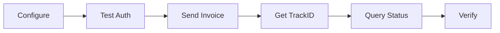

# 🚀 Quick Start Guide - 5 Minutes to First Invoice

## Prerequisites
- ✅ .NET 10 SDK installed
- ✅ Visual Studio Code or Visual Studio 2022
- ✅ Certificate P12 file
- ✅ RNC (Tax ID)

---

## Step 1: Clone & Configure (2 min)

```bash
# Clone repository
git clone https://github.com/rpdone/summacore-api-rd-v1.git
cd summacore-api-rd-v1

# Copy your certificate
cp /path/to/your/certificate.p12 ./13049552_identity.p12
```

Edit `appsettings.json`:
```json
{
  "Dgii": {
    "Environment": "PreCertification",
    "Rnc": "YOUR_RNC_HERE",
    "RazonSocial": "YOUR_COMPANY_NAME",
    "CertificatePath": "13049552_identity.p12",
    "CertificatePassword": "YOUR_PASSWORD"
  }
}
```

---

## Step 2: Build & Run (1 min)

```bash
# Restore packages
dotnet restore

# Run application
dotnet run
```

You should see:
```
=================================================
SummaCore DGII API Iniciado
Ambiente: Development
=================================================
Now listening on: https://localhost:7186
```

---

## Step 3: Test Authentication (1 min)

Open browser or use curl:
```bash
curl https://localhost:7186/api/pruebas/test-autenticacion
```

Expected response:
```json
{
  "status": "ok",
  "message": "Autenticación DGII exitosa",
  "environment": "PreCertification"
}
```

---

## Step 4: Send First Invoice (1 min)

### Option A: Using Excel Upload

1. Open `testecf.html` in browser
2. Select Excel file with invoices
3. Click "Subir y Procesar"
4. View results

### Option B: Using Postman/API

```bash
POST https://localhost:7186/api/CargaMasiva/procesar-plantilla-dgii
Content-Type: multipart/form-data

Form Data:
- archivoExcel: [your_file.xlsx]
```

---

## Step 5: Verify Result (30 sec)

Check console logs for:
```
[INFO] Factura E310000000001 ENVIADA → trackId: abc-123-xyz
```

Query status:
```bash
POST https://localhost:7186/api/pruebas/consultar-estatus-lote
Content-Type: application/json

["abc-123-xyz"]
```

---

## 🎉 Success!

You've just:
- ✅ Configured the API
- ✅ Authenticated with DGII
- ✅ Sent your first e-CF
- ✅ Received a trackId

---

## Next Steps

### 1. Prepare Excel Template
Download official DGII template and fill:
- Column C: TipoeCF (31, 32, 33, 34...)
- Column D: e-NCF (E310000000001)
- Columns 32-38: Emisor data
- Columns 51-53: Comprador data
- Columns 76-90: Totales
- Columns 100+: Items

### 2. Send Multiple Invoices
Use the Excel upload to send batches of invoices.

### 3. Test Receptor Endpoints
Verify your public endpoints are ready:
```bash
# Test reception
curl -X POST https://your-domain.com/fe/recepcion/api/ecf \
  -H "Content-Type: application/xml" \
  --data @sample_ecf.xml

# Test authentication
curl https://your-domain.com/fe/autenticacion/api/semilla
```

### 4. Start Certification
Follow `CERTIFICATION_CHECKLIST.md` to begin official certification process.

---

## Common Issues

### Issue: "Certificate not found"
**Solution:** Ensure `13049552_identity.p12` is in project root and copied to output:
```xml
<ItemGroup>
  <None Update="13049552_identity.p12">
    <CopyToOutputDirectory>Always</CopyToOutputDirectory>
  </None>
</ItemGroup>
```

### Issue: "Invalid password"
**Solution:** Verify password in `appsettings.json` matches certificate password.

### Issue: "Connection timeout"
**Solution:** Check internet connection and firewall rules. DGII servers must be accessible.

### Issue: "XML validation error"
**Solution:** Ensure all mandatory fields are filled according to e-CF type.

---

## Testing Different e-CF Types

### Type 31: Factura Crédito Fiscal
```csharp
TipoeCF = 31
RNCComprador = MANDATORY
FechaVencimientoSecuencia = "31-12-2025"
TipoIngresos = "01"
TipoPago = 1
```

### Type 32: Factura Consumo
```csharp
TipoeCF = 32
RNCComprador = OPTIONAL
FechaVencimientoSecuencia = NOT ALLOWED
```

### Type 33: Nota de Débito
```csharp
TipoeCF = 33
NCFModificado = "E310000000001" (MANDATORY)
FechaNCFModificado = "2025-11-20"
CodigoModificacion = 1
```

### Type 34: Nota de Crédito
```csharp
TipoeCF = 34
NCFModificado = "E310000000001" (MANDATORY)
FechaNCFModificado = "2025-11-20"
CodigoModificacion = 2
IndicadorNotaCredito = 2 (MANDATORY)
```

---

## API Endpoints Reference

### Health Check
```
GET /health
```

### Emisor Endpoints
```
POST /api/CargaMasiva/procesar-plantilla-dgii
POST /api/pruebas/consultar-estatus-lote
GET  /api/pruebas/test-autenticacion
```

### Receptor Endpoints
```
GET  /fe/autenticacion/api/semilla
POST /fe/autenticacion/api/validacioncertificado
POST /fe/recepcion/api/ecf
POST /fe/aprobacioncomercial/api/ecf
```

---

## Environment URLs

| Environment | Auth URL | Reception URL |
|-------------|----------|---------------|
| **Pre-Cert** | https://ecf.dgii.gov.do/testecf/autenticacion | https://ecf.dgii.gov.do/testecf/recepcion |
| **Cert** | https://ecf.dgii.gov.do/certecf/autenticacion | https://ecf.dgii.gov.do/CerteCF/Recepcion |
| **Prod** | https://ecf.dgii.gov.do/ecf/autenticacion | https://ecf.dgii.gov.do/ecf/recepcion |

---

## Support Resources

📚 **Documentation:**
- README.md - Complete implementation guide
- CERTIFICATION_CHECKLIST.md - Step-by-step certification
- Models/*.cs - XML structure reference

🌐 **DGII Resources:**
- Portal: https://dgii.gov.do
- e-CF Manual: https://dgii.gov.do/ecf/
- Support: ecf@dgii.gov.do

💻 **Code Examples:**
- See `Controllers/CargaMasivaController.cs` for bulk upload
- See `Controllers/DGIIController.cs` for receptor logic
- See `Services/DgiiService.cs` for DGII integration

---

## Development Workflow



---

## Production Checklist

Before going to production:

- [ ] Change environment to "Production"
- [ ] Update RNC with real company RNC
- [ ] Configure official NCF sequences
- [ ] Enable SSL certificate on domain
- [ ] Configure Azure Key Vault for secrets
- [ ] Set up Application Insights monitoring
- [ ] Configure backup strategy
- [ ] Test all endpoints from external network
- [ ] Document emergency procedures
- [ ] Train support team

---

**Ready to invoice! 🎯**

For detailed information, see:
- 📖 README.md
- ✅ CERTIFICATION_CHECKLIST.md
- 📧 Contact: ecf@dgii.gov.do